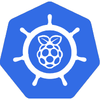

<div align="center">



## A Toca - K8s

My _Personal_ Kubernetes GitOps Repository

_... managed with ArgoCD and GitHub Actions_

</div>

<div align="center">

[](https://k3s.io/)&nbsp;&nbsp;
[](https://talos.dev)&nbsp;&nbsp;
[](https://unraid.net/)&nbsp;&nbsp;
</div>

<div align="center">

&nbsp;&nbsp;
[](https://github.com/kashalls/kromgo/)&nbsp;&nbsp;
[](https://github.com/kashalls/kromgo/)&nbsp;&nbsp;
[](https://github.com/kashalls/kromgo/)&nbsp;&nbsp;
[](https://github.com/kashalls/kromgo/)&nbsp;&nbsp;
[](https://github.com/kashalls/kromgo/)&nbsp;&nbsp;
[](https://github.com/kashalls/kromgo/)&nbsp;&nbsp;
[](https://github.com/kashalls/kromgo/)&nbsp;&nbsp;

</div>

<div align="center">

&nbsp;
[](https://github.com/kashalls/kromgo/)&nbsp;&nbsp;
[](https://github.com/kashalls/kromgo/)&nbsp;&nbsp;
[](https://github.com/kashalls/kromgo/)&nbsp;&nbsp;
[](https://github.com/kashalls/kromgo/)&nbsp;&nbsp;

</div>

---

## 📖 Overview

This is a mono repository for my home infrastructure and Kubernetes cluster. I try to adhere to Infrastructure as Code (IaC) and GitOps practices using the tools like [Kubernetes](https://kubernetes.io/), [ArgoCD](https://argoproj.github.io/argo-cd/), [GitHub Actions](https://github.com/features/actions).

---

### Installation

My cluster is a 3-node high-availability setup running on bare-metal Talos Linux. All three nodes function as control planes (no dedicated workers), providing both compute and distributed storage via Rook-Ceph. This hyper-converged architecture maximizes resource utilization across all nodes, with each node contributing:

- Compute: Kubernetes workload scheduling
- Storage: 1TB NVMe disk for Ceph distributed storage (block, filesystem, and object)
- Control Plane: etcd member and Kubernetes API server

The cluster uses 2-way replication for storage, tolerating one node failure while maintaining data availability.

---

### Core Components

**Networking & Ingress:** [cilium](https://cilium.io/) provides eBPF-based networking with Gateway API support and L2 announcements for LoadBalancer IPs. [cloudflare-ingress](https://github.com/STRRL/cloudflare-tunnel-ingress-controller) secures external access via Cloudflare Tunnel, while [external-dns](https://github.com/kubernetes-sigs/external-dns) automatically syncs DNS records to Cloudflare and AdGuard Home.

**Security & Secrets:** [cert-manager](https://cert-manager.io/) automates SSL/TLS certificate management using Cloudflare DNS-01 challenges. For secrets, [external-secrets](https://external-secrets.io/) integrates with [1Password Connect](https://github.com/1Password/connect-helm-charts) to inject secrets into Kubernetes, while [sealed-secrets](https://github.com/bitnami-labs/sealed-secrets) stores encrypted secrets safely in Git.

**Storage & Backup:** [rook-ceph](https://rook.io/) provides distributed storage with block (RBD), filesystem (CephFS), and object (S3) storage capabilities across the 3-node cluster. [volsync](https://volsync.readthedocs.io/) handles volume snapshots and replication for backup/restore. [spegel](https://github.com/spegel-org/spegel) improves reliability by running a stateless cluster-local OCI image mirror. [crunchy-postgres-operator](https://github.com/CrunchyData/postgres-operator) manages highly available PostgreSQL clusters.

**Monitoring & Observability:** [kube-prometheus-stack](https://github.com/prometheus-operator/kube-prometheus) delivers comprehensive monitoring with Prometheus, Alertmanager, and Grafana. [metrics-server](https://github.com/kubernetes-sigs/metrics-server) provides resource metrics for autoscaling and kubectl top commands.

**Automation & CI/CD:** [actions-runner-controller](https://github.com/actions/actions-runner-controller) runs self-hosted GitHub Actions runners directly in the cluster for continuous integration workflows.

**Cluster Utilities:** [descheduler](https://github.com/kubernetes-sigs/descheduler) optimizes pod placement, while [reloader](https://github.com/stakater/Reloader) automatically restarts pods when ConfigMaps or Secrets change.

---

### Directories

This Git repository contains the following directories.

```sh
📁 .github              # GitHub workflows for CI/CD
📁 apps                 # Applications deployed in the cluster
  └─📁 {category}       # Organized by function: media, data, auth, communication, etc.
📁 argocd               # ArgoCD configuration and parent applications
  └─📁 applications     # Parent apps that discover and manage child apps
  └─📁 install          # ArgoCD installation manifests
📁 docs                 # Extra documentation and assets
📁 infra                # Core infrastructure configurations
  └─📁 ansible          # Ansible playbooks for cluster bootstrap
  └─📁 k8s              # Kubernetes infrastructure by category
    └─📁 networking     # CNI, ingress, DNS (Cilium, Envoy Gateway, etc.)
    └─📁 storage        # Storage systems (Rook-Ceph, CSI drivers, etc.)
    └─📁 security       # Security tools (cert-manager, sealed-secrets, etc.)
    └─📁 monitoring     # Monitoring stack (Prometheus, Grafana)
    └─📁 cluster-mgmt   # Cluster utilities (metrics-server, reloader, etc.)
    └─📁 operators      # Kubernetes operators (Postgres, GPU, etc.)
  └─📁 talos            # Talos Linux node configurations
  └─📁 terraform        # Terraform configurations
📁 stacks               # Docker Compose files for Asustor NAS
  └─📁 media-stack      # Media management stack
📁 terraform            # Terraform for cloud resources (Cloudflare, etc.)
```

---

### Networking

| Name                      | CIDR                |
|---------------------------|---------------------|
| Server VLAN               | `192.168.40.0/24`   |
| Kubernetes pods (Cilium)  | `10.244.0.0/16`     |
| Kubernetes services       | `10.96.0.0/12`      |
| Gateway LoadBalancer IP   | `192.168.60.10`     |

---

## ☁️ Cloud Dependencies

While most of my infrastructure and workloads are self-hosted I do rely upon the cloud for certain key parts of my setup. This saves me from having to worry about two things. (1) Dealing with chicken/egg scenarios and (2) services I critically need whether my cluster is online or not.

| Service                                         | Use                                                               | Cost            |
|-------------------------------------------------|-------------------------------------------------------------------|-----------------|
| [1Password](https://1password.com/)             | Secrets with 1Password Connect and Controler                      | ~$65/yr         |
| [Cloudflare](https://www.cloudflare.com/)       | Domain and R2                                                     | ~$30/yr         |
| [GitHub](https://github.com/)                   | Hosting this repository and continuous integration/deployments    | Free            |
| [Tailscale](https://tailscale.com/)             | VPN Serice                                                        | Free            |
|                                                 |                                                                   |Total: ~$7,90/mo |

---

## 🔧 Hardware

| Device                          | Count | OS Disk Size | Data Disk Size | RAM  | CPU              | Operating System | Purpose                    |
|---------------------------------|-------|--------------|----------------|------|------------------|------------------|----------------------------|
| Mini PC                         | 3     | 256GB NVMe   | 1TB NVMe       | 16GB | Ryzen 7 4800H    | Talos Linux 1.9  | K8s control plane nodes    |
| Asustor AS5404T                 | 1     | 32GB (USB)   | 4x 1TB + 4x 12TB | 32GB | Intel Celeron  | Unraid 7.1.4     | NAS (external storage)     |

---

## 💪 TO-DO

- [x] Ansible playbook for deploying the cluster
- [x] Implement terraform for managing cloud resources

---

## 🤝 Gratitude and Thanks

Thanks to all the people who share their knowledge and experience on Github. I have learned a lot from reading blog posts and watching YouTube videos. I have tried to link to the sources of my inspiration where possible

- [k8s-at-home](https://github.com/topics/k8s-at-home)
- [Christian Lempa](https://www.youtube.com/@christianlempa)
- [pi-cluster](https://github.com/ricsanfre/pi-cluster)

---

## 📜 Changelog

See my _awful_ [commit history](https://github.com/guilhermewolf/atoca.house/commits/main)

---

## 🔏 License

See [LICENSE](./LICENSE)
